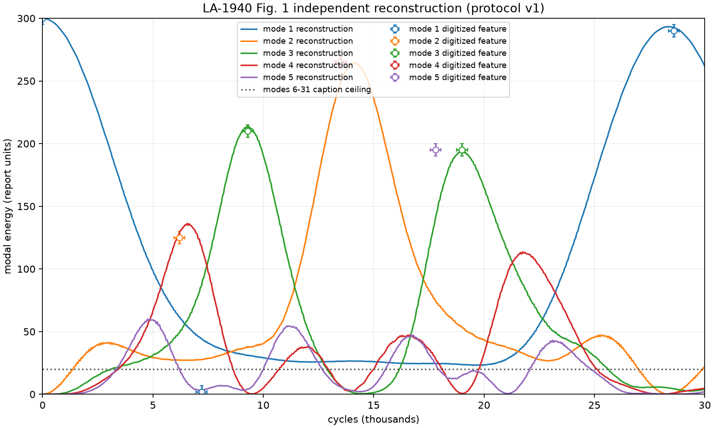

# FPUT recurrence reproduction

## What was run

The frozen protocol-v1 baseline ran 30,000 velocity-Verlet cycles for `N=32`,
`alpha=1/4`, `delta t=1/sqrt(8)`, fixed endpoints, and a from-rest mode-1 sine
wave. It sampled all modal energies every 50 cycles, ran the 10,000-cycle
linear control and the equal-duration 60,000-cycle `delta t/2` control, and
finished in 1.759 seconds. The plotted values use `E_k(t)/E_1(0)*300`.

## Provenance and reference

The primary source is the OSTI copy at
<https://www.osti.gov/servlets/purl/4376203>, DOI
<https://doi.org/10.2172/4376203>. Its manifest pins the 1,570,076-byte PDF
with SHA-256
`3155813b1851da4fa6fba5818986718b197d68873d38965f3cd7489c14f396f1`; the PDF
is public-domain US Government work and is intentionally not tracked. The
Fig. 1 crop and CSV are digitized calibration evidence with ±250-cycle and
±5-energy-unit uncertainty, not original numerical output. Dauxois, Peyrard
and Ruffo, *The Fermi–Pasta–Ulam numerical experiment: history and pedagogical
perspectives* (Eur. J. Phys. 26 (2005) S3, arXiv:nlin/0501053), is retained as
secondary historical context, not as the target source.

## Shortlist and choice

The considered alternatives were M. Hénon and C. Heiles, AJ 69, 73 (1964),
whose Poincaré-section area fractions are accessible through ADS but whose AAS
copyright limits figure redistribution, and E. N. Lorenz, JAS 20, 130 (1963),
whose AMS-copyrighted Table 1 values have a weaker connection to the planned
chapters. LA-1940 was chosen because it has a stable full source, permits the
public-domain figure crop, is fully specified enough for independent
reconstruction, has a trivial 32-particle/30,000-step compute envelope, and
directly motivates the waves and numerical-error chapters.

## Assumptions and limits

- “Derivatives replaced by difference expressions” is reconstructed as an
  explicit position-space Störmer–Verlet / velocity-Verlet update; no author
  code exists.
- The baseline uses `delta t=1/sqrt(8)`, because the report distinguishes the
  cycle abscissa `delta t` from the caption's acceleration coefficient
  `delta t^2=1/8`. The alternative `delta t=1/8` is exploratory only.
- The chain starts from rest, with `x_i=sin(i*pi/N)`, fixed ends, unit masses,
  `beta=0`, and float64 deterministic arithmetic.
- The plotted modal energy omits nonlinear potential energy as the report's
  mode analysis does; full-energy conservation is a separate control.
- Digitization is approximate and the trace is not a substitute for the
  original MANIAC data.

## What came out

Reproduction status: **failed control; scientific verdict inconclusive**.
The measured protocol metrics are:

- **M1 pass:** recurrence at 28,400 cycles versus 28,600, within the
  ±1,000-cycle tolerance (digitization uncertainty ±250 cycles).
- **M2 pass:** recurrence fraction 0.977753 versus 0.966667, an absolute
  residual of 0.011087 within the ±0.03 tolerance.
- **M3 fail:** the literal first sampled local maxima were mode 2 at cycle 200
  with fraction 0.002458 (reference 6,200 and 0.416667), mode 3 at cycle 3,000
  with 0.064594 (reference 9,300 and 0.700000), and mode 4 at cycle 6,450 with
  0.450343 (reference 13,500 and 0.883333). Each misses the ±5% time and ±0.10
  energy-fraction tolerances; reference uncertainty is ±250 cycles and ±5
  report units.
- **M4 fail:** modes 6–31 reached a summed fraction of 0.084518 (25.355 report
  units), above the caption ceiling and tolerance 0.066667 (20 units).
- **C1 pass:** maximum linear mode-1 drift was 0.000300832 (0.0301%), below
  0.01.
- **C2 pass:** maximum full-energy drift was 0.00201560 (0.2016%), below 0.01.
- **C3 fail:** halving `delta t` moved the physical recurrence from
  10,040.9163 to 9,528.26388, a relative movement of 0.0510563 (5.106%), above
  the strict 0.01 tolerance.

## What is shaky

The primary recurrence agrees with the digitized figure, but the failed C3
control means that agreement is not stable under the preregistered time-step
test. M3 interprets “first local maximum” literally on the 50-cycle sampled
series; early small oscillations therefore count, because no smoothing or
prominence rule was preregistered. The original integration ordering remains
inferred rather than recovered from author code. These discrepancies are
retained without changing protocol v1 or its tolerances.

## Next

Milestone 3 may present this result and its limitations, but any changed
method or feature-extraction rule requires a dated protocol v2 amendment.
